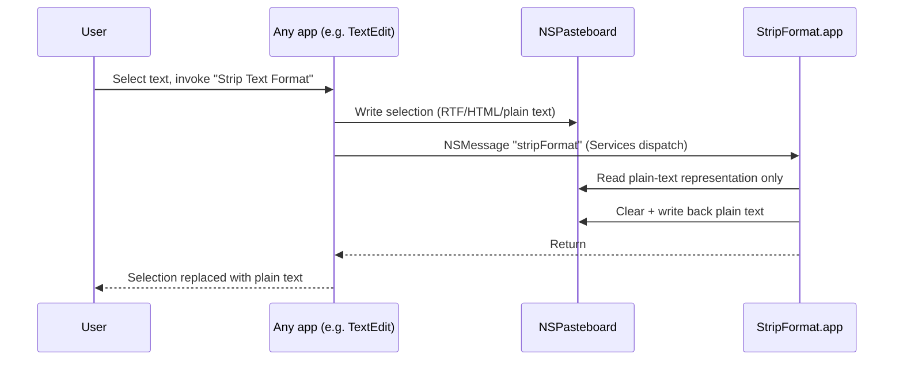

# StripFormat

> Strip rich-text formatting from your current selection, from any app's Services menu.

StripFormat is a macOS Services-menu app. It registers a system Service, "Strip Text
Format," that any app can invoke — via the Services menu or a bound keyboard shortcut —
to take the current text selection off the pasteboard and write it back as plain text.
It's for anyone who's ever pasted from a PDF, a web page, or a formatted email and gotten
a mess of fonts, colors, and inline styles along with the words they wanted. Unlike a
clipboard manager or a "paste and match style" shortcut (which only helps in apps that
support it), a Service works system-wide, in any app that offers a Services menu. The
trade-off: it's macOS-only, and it only strips formatting that lives in the pasteboard's
rich-text representation — see [Known Limitations](#known-limitations).

<!-- 🖊 TODO: Pick a status line:
> **Status:** Active development — early, single-file project.
> **Status:** Stable — used daily, no planned changes.
-->

---

## Table of Contents

- [Features](#features)
- [How It Works](#how-it-works)
- [Prerequisites](#prerequisites)
- [Installation](#installation)
- [Testing](#testing)
- [Usage](#usage)
- [Troubleshooting](#troubleshooting)
- [Known Limitations](#known-limitations)
- [Architecture](#architecture)
- [Contributing](#contributing)
- [License](#license)

---

## Features

- **One Services-menu entry** — "Strip Text Format" appears in the Services menu of any
  app that puts plain text on the pasteboard.
- **Keyboard-shortcut friendly** — bind it once in System Settings and never touch the
  menu again.
- **No Dock icon, no windows** — the app runs with `LSUIElement` / `.accessory`
  activation policy, so it sits idle in the background and does nothing until the
  Service is invoked.
- **Zero configuration** — no preferences, no config file, nothing to set up beyond
  installing it.

---

## How It Works

The "stripping" isn't a text-processing step — there's no regex or HTML parser in the
code. It works because of how `NSPasteboard` represents rich content: a copied selection
from, say, TextEdit typically carries several representations on the pasteboard (RTF,
HTML, plain text). StripFormat's Service handler reads back *only* the plain-text
representation (`NSPasteboard.string(forType: .string)`, matching the `NSSendTypes` /
`NSReturnTypes` of `public.utf8-plain-text` declared in `Info.plist`), then clears the
pasteboard and writes that plain string straight back. Whatever formatting existed only
in the RTF/HTML representations is discarded in the process.

The whole implementation is `ServiceProvider.stripFormat(_:userData:error:)` in
[`Sources/StripFormat/main.swift`](Sources/StripFormat/main.swift). Each invocation logs
via Swift's `Logger` under the subsystem `com.peterichardson.stripformat` (category
`service`) — deliberately logging only counts and success flags, never the clipboard text
itself, since that could contain passwords or other sensitive data — see
[Troubleshooting](#troubleshooting) to watch it live.

---

## Prerequisites

- **macOS 13 (Ventura) or later** — declared in `Package.swift` (`.macOS(.v13)`)
- **Swift toolchain / Xcode Command Line Tools** — developed against Swift 6.3.3
  (`swift --version` to check yours)

---

## Installation

```sh
swift build                # debug build, output in .build/debug/
swift build -c release     # release build, output in .build/release/
```

To actually use it as a Service, it needs to be a registered `.app` bundle — a plain
binary isn't enough. `build.sh` does the full install:

```sh
./build.sh
```

This runs a release build, assembles `StripFormat.app` (binary + `Info.plist`), copies
it to `/Applications/StripFormat.app`, and re-registers it with Launch Services via
`lsregister` so the Service shows up right away.

### Verify

```sh
/System/Library/Frameworks/CoreServices.framework/Frameworks/LaunchServices.framework/Support/lsregister -dump \
  | grep -A5 com.peterichardson.stripformat
```

---

## Testing

```sh
swift test
```

`ServiceProvider`'s core transform logic (`ServiceProvider.stripFormat(on:)`) is covered
by `Tests/StripFormatTests` against a fake pasteboard conforming to `PasteboardWriting`.
The `@objc` Services entry point itself and the real system-pasteboard integration are
still verified by hand — see [Troubleshooting](#troubleshooting).

---

## Usage

There's no CLI — StripFormat has no `main.swift` argument parsing; it's invoked entirely
through the Services menu.

1. Select some text in any app.
2. Invoke the Service, either:
   - **Menu:** `AppName ▸ Services ▸ Strip Text Format`, or
   - **Shortcut:** bind one under **System Settings ▸ Keyboard ▸ Keyboard Shortcuts ▸
     Services ▸ Text**, find "Strip Text Format," and record a key combo.
3. The selection is replaced with its plain-text equivalent, ready to paste.

**Gotcha:** apps read the Services list once, at launch, and cache it. After `build.sh`
(re-)registers the Service, any target app that was already running (TextEdit, Stickies,
etc.) must be fully quit (**⌘Q**) and reopened before the menu entry reflects the change
— otherwise invoking it silently no-ops. A full logout/login also works but is rarely
necessary.

---

## Troubleshooting

There's no test target — verification is manual (install, select text elsewhere, invoke
the Service). If the menu item doesn't appear or invoking it does nothing:

- **Confirm the target app has re-read the Services list** — quit and reopen it (see the
  gotcha above).
- **Confirm registration** with the `lsregister -dump` command in
  [Installation](#installation).
- **Watch it run** via Console.app, or from a terminal:
  ```sh
  log stream --predicate 'subsystem == "com.peterichardson.stripformat"' --level debug
  ```
  Every invocation logs the incoming pasteboard types, the plain text it read, and
  whether writing back succeeded.

---

## Known Limitations

- **macOS only** — built on Cocoa (`NSPasteboard`, `NSServices`, `NSApplication`); there's
  no equivalent on other platforms.
- **Plain-text pasteboard content only** — the Service's `NSSendTypes`/`NSReturnTypes`
  are `public.utf8-plain-text`. An app that puts *only* rich text on the pasteboard, with
  no plain-text fallback representation, won't offer this Service at all.
- **No configurable behavior** — the output is always exactly the pasteboard's
  plain-text string; there's no option to, say, preserve line breaks differently or
  strip only some formatting.
- **Partial automated coverage** — `ServiceProvider.stripFormat(on:)`'s guard/logging
  logic has unit tests (`Tests/StripFormatTests`) against a fake pasteboard, but the
  `@objc` Services entry point itself and the real system-pasteboard integration are
  still verified by hand (see [Troubleshooting](#troubleshooting)).
- **Services-menu caching** — see the gotcha in [Usage](#usage); this is a macOS
  behavior, not something StripFormat can work around.

---

## Architecture

A small Swift executable — `Sources/StripFormat/main.swift` for the app bootstrap,
`Sources/StripFormat/ServiceProvider.swift` for the Service logic — packaged as an `.app`
bundle (via `build.sh` + `Info.plist`) rather than shipped as a plain CLI binary, because
macOS Services only work from an app bundle registered with Launch Services.



- `Info.plist` declares the `NSServices` entry: menu title "Strip Text Format",
  `NSMessage` `stripFormat`, sending/returning `NSStringPboardType`. This is what makes
  the app discoverable in the system Services menu.
- `ServiceProvider.swift` defines `ServiceProvider`, whose `@objc stripFormat(_:userData:error:)`
  method signature must match the `NSMessage` name in `Info.plist` — AppKit invokes it by
  Objective-C selector name via `NSApplication.servicesProvider`, so the two stay coupled
  even though nothing in the Swift code references the plist directly. `ServiceProvider`
  is declared `final` since it's never subclassed. The core transform
  logic is a separate `static func stripFormat(on:)` taking a `PasteboardWriting` protocol
  instead of a concrete `NSPasteboard`, so it can be exercised in `StripFormatTests`
  without a real pasteboard.

---

## Contributing

<!-- 🖊 TODO: No CONTRIBUTING.md yet. Minimal scaffold below — replace or expand once
     there's an actual process (issue tracker, PR expectations, etc.). -->

This is a small, single-file project — clone it, edit `Sources/StripFormat/main.swift`
for transform logic or `Info.plist` for the Services entry, then verify with
`./build.sh` and a manual test as described in [Usage](#usage).

---

## License

Licensed under the **MIT License** — see [LICENSE](LICENSE) for details.
